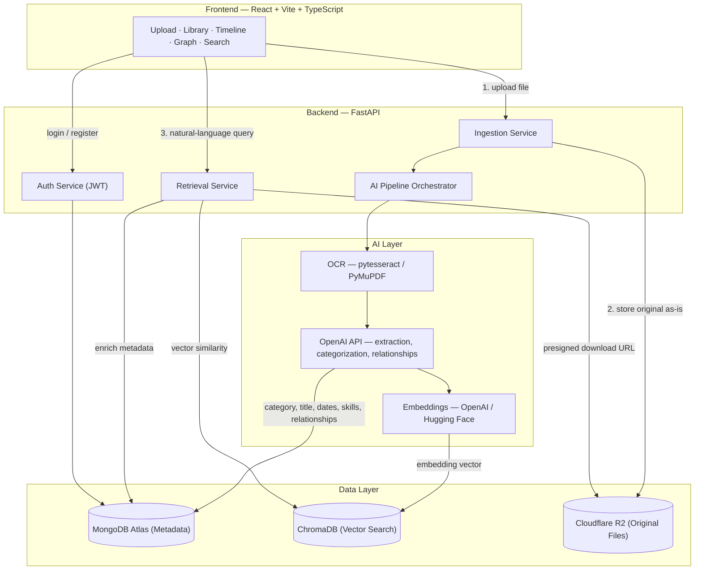
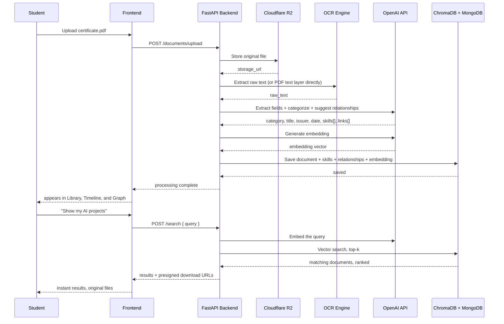

# KizunaX
### AI-Powered Digital Identity System for Students


---

## 1. Tagline

**"Every certificate, project, and internship — understood, connected, and instantly findable. You never have to search a folder again."**

## 2. Vision

Students accumulate proof of their growth — a certificate here, a hackathon repo there, an internship letter buried in an email thread — but that proof stays scattered and mute. KizunaX exists to turn that scattered archive into a living record: a system that reads what a student uploads, understands what it means, and quietly stitches it into a single, explorable story of who they're becoming.

## 3. Mission

- Remove manual filing entirely — categorization happens the moment a file lands.
- Make every skill, project, certificate, and internship aware of the others it's connected to.
- Turn a folder of PDFs into a timeline a recruiter — or the student themselves — can actually read.
- Never trap the original file. Every document stays downloadable in its original format, forever.
- Ship something an evaluator can test live in under two minutes: upload a certificate, watch it categorize itself, ask for it back in plain English.

## 4. Problem Statement

A student's academic and professional life produces a constant stream of documents — certificates, resumes, project reports, internship letters, portfolio links — and almost none of it lives anywhere coherent. It's spread across downloads folders, email attachments, and cloud drives, disconnected from each other even when one directly caused the next (a certification that led to a skill, a skill that got used in a project, a project that led to an internship).

Cloud storage solves *retrieval by memory* — you can find a file if you remember where you put it. It does nothing for *retrieval by meaning* — "show me proof I know Python" — and nothing at all for showing how the pieces connect over time.

KizunaX is not another drive. It's a system that reads a document once, understands what it is and what it proves, and files it, links it, and time-stamps it automatically — so the student's entire journey becomes a single searchable, connected identity instead of a pile of unrelated files.

## 5. Key Questions This Product Answers

| Question | How KizunaX answers it |
|---|---|
| **Intelligent Organization** — can uploads be organized without manual sorting? | Every upload runs through OCR → LLM extraction → categorization the moment it's received. No folders to pick, no tags to type. |
| **Knowledge Connections** — can the system connect skills, projects, certifications, internships, and achievements? | The Relationship Engine compares each new document against the student's existing corpus and creates typed edges — Certification → Skill → Project → Internship → Career Path. |
| **Instant Retrieval** — can users get any document back without digging through folders? | The Smart Retrieval System answers natural-language queries ("show my AI projects") with a vector search over everything the student has uploaded, and always hands back the original file. |

## 6. Core Modules

### Module 1 — AI Data Ingestion
Accepts certificates, resumes, project reports, internship letters, portfolio links, and general academic/professional documents via drag-and-drop or link paste. Every file is preserved byte-for-byte in object storage before anything else happens to it.

### Module 2 — Intelligent Categorization
Classifies each upload into **Projects, Skills, Certifications, Internships, Achievements,** or **Academics** without the student choosing a category. Classification is a byproduct of the same LLM call that extracts the document's fields, not a separate manual step.

### Module 3 — Relationship Engine
Builds typed edges across the student's corpus: `Certification → Skill`, `Skill → Project`, `Project → Internship`, `Internship → Career Path`. 

### Module 4 — Digital Journey Timeline
Every extracted date becomes a point on a chronological timeline of the student's growth.

### Module 5 — Smart Retrieval System
Natural-language queries — *"show all my certificates," "show my AI projects," "show my latest resume"* — return matching documents in their original format via a semantic (vector) search, not a filename or folder lookup.

---

## 7. System Architecture



## 8. AI Pipeline Walkthrough



---

## 9. Tech Stack

### 9.1 Frontend

| Choice | Why |
|---|---|
| **React 18 + Vite** | Fast dev server, strong type safety catches mistakes before they hit the browser. |
| **Custom Vanilla CSS** | Clean Glassmorphism design and deep dark mode. Avoids generic utility frameworks in favor of bespoke aesthetics. |
| **Axios** | Robust HTTP client for handling API requests and file uploads securely. |
| **Lucide React** | Clean, consistent icons across the UI. |
| **Recharts** | Visualizes the Digital Journey Timeline. |

### 9.2 Backend

| Choice | Why |
|---|---|
| **Python 3.10+ + FastAPI** | Async by default, auto-generates OpenAPI docs at `/docs`, and every AI/NLP library needed is Python-native. |
| **Beanie ODM + Motor** | Async Python object-document mapper for MongoDB, building on top of Pydantic for validation. |
| **python-jose + passlib[bcrypt]** | JWT auth and password hashing; secure defaults. |
| **python-multipart** | Required by FastAPI for handling robust file uploads. |

### 9.3 Database & Vector Search

| Choice | Why |
|---|---|
| **MongoDB Atlas** | Document-oriented storage fits naturally for complex nested metadata like extracted skills and timeline events. |
| **ChromaDB** | Vector database for storing and querying OpenAI/HuggingFace embeddings seamlessly to enable semantic search. |

### 9.4 Object Storage

| Choice | Why |
|---|---|
| **Cloudflare R2** | S3-compatible, no egress fees. Files are stored exactly as uploaded and served back via temporary presigned URLs. |

### 9.5 AI / NLP Layer

| Choice | Why |
|---|---|
| **pytesseract / PyPDF2 / pdf2image** | Baseline OCR and native PDF text extraction. |
| **OpenAI GPT-4o-mini** | Does the actual understanding: turns messy OCR text into structured fields, assigns a category, and reasons about relationships. |
| **OpenAI (text-embedding-3-small) / Hugging Face** | Generates the dense vector embeddings used by ChromaDB for the smart search retrieval system. |

---

## 10. API Surface

| Method | Endpoint | Purpose |
|---|---|---|
| `POST` | `/api/auth/register` | Create account |
| `POST` | `/api/auth/login` | Get JWT |
| `GET` | `/api/auth/me` | Current user profile |
| `POST` | `/api/upload/` | Upload a file, kicks off the AI pipeline |
| `GET` | `/api/documents/` | List documents; filter by category, date range |
| `GET` | `/api/documents/{id}` | Single document, with extracted fields |
| `DELETE` | `/api/documents/{id}` | Remove a document |
| `POST` | `/api/search/` | Natural-language query → Vector Search → ranked documents |
| `GET` | `/api/timeline/` | Chronological event list |
| `GET` | `/api/search/skills` | All skills, with source documents |
| `GET` | `/api/timeline/relationships` | Graph data for the relationship visualization |
| `GET` | `/api/integrations/status` | Check Google Drive/Notion Auth statuses |

*(Interactive Swagger docs available at `http://localhost:8000/docs` when the backend is running).*

## 11. Repository Structure

```text
KizunaX/
├── backend/                 # FastAPI backend
│   ├── app/
│   │   ├── api/            # Route handlers
│   │   ├── core/           # Config, security
│   │   ├── models/         # Beanie ODM models
│   │   ├── repositories/   # DB query abstraction layer
│   │   ├── services/       # Business logic & AI pipeline
│   │   └── integrations/   # Google Drive & Notion
│   ├── data/               # Local uploads & ChromaDB storage
│   ├── main.py            # Entry point
│   ├── requirements.txt   # Dependencies
│   └── .env.example       # Template env vars
├── frontend/               # React/Vite frontend
│   ├── src/
│   │   ├── components/    # Reusable UI components
│   │   ├── pages/         # Core views (Dashboard, Library, etc)
│   │   ├── lib/           # Utils
│   │   └── styles.css     # Bespoke CSS System
│   └── package.json       
└── specs/                 # Comprehensive documentation
```

## 12. Environment Variables

To run the project, copy the `backend/.env.example` file to `backend/.env` and fill in your specific keys. 

You will need configurations for:
- MongoDB URI
- Cloudflare R2 Credentials
- OpenAI API Key
- A generated Secret Key for JWT auth
- (Optional) Google Drive and Notion OAuth Client IDs

*Note: For security reasons, never commit the `.env` file to version control.*

## 13. Deployment

### Docker Deployment (Recommended)
```bash
# Build backend
cd backend
docker build -t kizunax-backend .

# Build frontend
cd frontend
docker build -t kizunax-frontend .

# Run with docker-compose
docker-compose up -d
```

### Manual Run
**Backend:**
```bash
cd backend
python -m venv venv
source venv/bin/activate  # or venv\Scripts\activate on Windows
pip install -r requirements.txt
python main.py
```
**Frontend:**
```bash
cd frontend
npm install
npm run dev
```

## 14. Success Metric

The demo succeeds the moment a reviewer uploads a certificate, watches it categorize and link itself with no manual input, then types *"show me my certificates"* and gets the original file back instantly. That single loop — upload → understand → retrieve — is the whole pitch.

## 15. Future Enhancements

- Confidence scores surfaced in the UI so students can correct a wrong category/relationship
- Portfolio export as a public shareable link
- Multi-language OCR/extraction for certificates issued in languages other than English
- A "career path suggestion" pass that reasons across the whole graph, not just document-to-document
