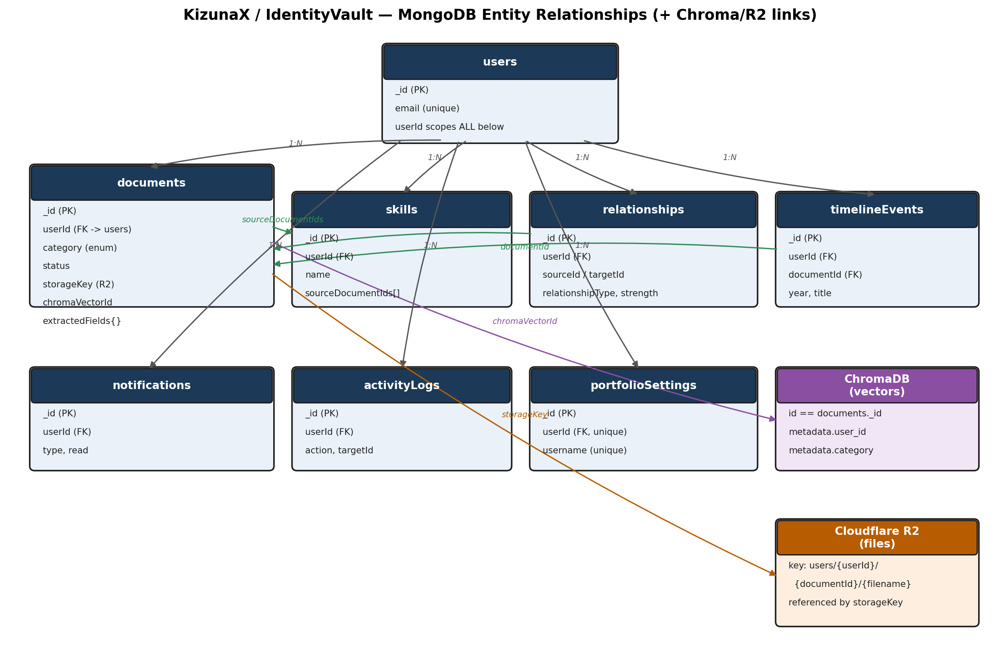

# KizunaX — Database Schema & Data Flow

This document defines the complete data layer (MongoDB + ChromaDB + Cloudflare R2) and
traces exactly how data moves between the frontend, backend, AI services, and storage
for every core operation. Read this alongside `KizunaX_Frontend_Detailed_Doc.md` and
`KizunaX_Backend_Detailed_Doc.md` — this document is the shared source of truth both of
those reference.

---

## 1. Entity Relationship Diagram



Every collection below carries a `userId` — this is the single field that makes
multi-tenancy work. There is no collection, index, or query anywhere in this system
that omits it.

---

## 2. Full MongoDB Schema

### 2.1 `users`
| Field | Type | Constraints |
|---|---|---|
| `_id` | ObjectId | PK |
| `fullName` | String | required, 2–100 chars |
| `email` | String | required, unique, lowercase, indexed |
| `passwordHash` | String | null if OAuth-only |
| `authProvider` | String | `"local"` \| `"google"` |
| `googleId` | String | null unless OAuth |
| `isActive` | Boolean | default `true` |
| `isVerified` | Boolean | default `false` |
| `createdAt` / `updatedAt` | Date | auto |

Index: `{ email: 1 }` unique.

### 2.2 `documents`
| Field | Type | Constraints |
|---|---|---|
| `_id` | ObjectId | PK — also used as the ChromaDB vector id |
| `userId` | ObjectId | required, indexed |
| `filename`, `originalFilename` | String | |
| `storageKey` | String | Cloudflare R2 object key — the file itself is NEVER in Mongo |
| `fileType`, `fileSizeBytes` | String, Number | |
| `status` | String | `uploading` \| `extracting` \| `classifying` \| `indexed` \| `failed` |
| `failureReason` | String | nullable, always set when `status = failed` |
| `category` | String | **enum**: `Projects`\|`Skills`\|`Certifications`\|`Internships`\|`Achievements`\|`Academics` |
| `categoryConfidence` | Number | 0–1 |
| `categoryOverridden` | Boolean | true if user manually re-tagged |
| `extractedText` | String | full parsed/OCR text |
| `extractedFields` | Object | `{ issuer, issueDate, organization, skillsDetected: [String] }` |
| `chromaVectorId` | String | == `_id`, kept in sync |
| `isDeleted` | Boolean | soft delete, default false |
| `createdAt` / `updatedAt` | Date | |

Indexes: `{ userId: 1, category: 1 }`, `{ userId: 1, createdAt: -1 }`,
`{ userId: 1, isDeleted: 1 }`, text index on `{ filename, extractedText }`.

### 2.3 `skills`
| Field | Type |
|---|---|
| `_id` | ObjectId |
| `userId` | ObjectId, indexed |
| `name`, `normalizedName` | String |
| `sourceDocumentIds` | [ObjectId] |
| `onResume` | Boolean |
| `hasEvidence` | Boolean — computed: `sourceDocumentIds.length > 0` |
| `confidenceScore` | Number |
| `firstDetectedAt` / `updatedAt` | Date |

Index: `{ userId: 1, normalizedName: 1 }` unique compound.

### 2.4 `relationships`
| Field | Type |
|---|---|
| `_id` | ObjectId |
| `userId` | ObjectId, indexed |
| `sourceType` / `sourceId` | String / ObjectId |
| `targetType` / `targetId` | String / ObjectId |
| `relationshipType` | `"backs"` \| `"leadsTo"` \| `"derivedFrom"` |
| `strength` | Number, 0–1 |
| `aiGenerated` | Boolean |
| `createdAt` | Date |

Indexes: `{ userId: 1 }`, `{ sourceId: 1 }`, `{ targetId: 1 }`.

### 2.5 `timelineEvents`
| Field | Type |
|---|---|
| `_id` | ObjectId |
| `userId` | ObjectId, indexed |
| `year` / `month` | Number |
| `title`, `description` | String |
| `category` | String (enum, same as documents) |
| `documentId` | ObjectId, ref |
| `createdAt` | Date |

Index: `{ userId: 1, year: 1, month: 1 }`.

### 2.6 `notifications`
| Field | Type |
|---|---|
| `_id` | ObjectId |
| `userId` | ObjectId, indexed |
| `type` | `document_classified`\|`relationship_detected`\|`timeline_updated`\|`skill_gap`\|`portfolio_viewed` |
| `title`, `message` | String |
| `relatedDocumentId` | ObjectId, nullable |
| `read` | Boolean, default false |
| `createdAt` | Date |

Index: `{ userId: 1, read: 1, createdAt: -1 }`.

### 2.7 `activityLogs`
| Field | Type |
|---|---|
| `_id` | ObjectId |
| `userId` | ObjectId, indexed |
| `action` | `upload`\|`retag`\|`delete`\|`search`\|`export` |
| `targetType` / `targetId` | String / ObjectId |
| `metadata` | Object |
| `createdAt` | Date |

Index: `{ userId: 1, createdAt: -1 }`. Consider a TTL to auto-expire after 12 months.

### 2.8 `portfolioSettings`
| Field | Type |
|---|---|
| `_id` | ObjectId |
| `userId` | ObjectId, unique |
| `username` | String, unique — used in `/u/:username` |
| `theme` | String |
| `visibleCategories` | [String] |
| `hiddenDocumentIds` | [ObjectId] |
| `isPublished` | Boolean |
| `publishedAt` / `updatedAt` | Date |

---

## 3. ChromaDB Schema (single collection, metadata-isolated)

```
Collection name: "kizunax_documents"  (ONE collection for all users — isolation is
                                        done via metadata filtering, not one
                                        collection per user)

Per-vector record:
  id:        string  — MUST equal the MongoDB document's _id (string form).
                        Never generate a separate random Chroma id.
  embedding: vector  — generated from `extractedText` (chunk if it exceeds the
                        embedding model's context window; never silently truncate
                        and drop meaning-bearing content without chunking).
  metadata:  {
    user_id:    string,   // REQUIRED on every write and every query filter
    category:   string,
    year:       number,
    filename:   string,
  }
  document:  string  — the extractedText itself, stored alongside the vector.
```

**Every query, no exceptions:** `where={"user_id": current_user_id, ...}`. This is
the enforcement point for tenant isolation at the vector-search layer — it must never
depend on a downstream MongoDB re-check to "catch" cross-tenant results after the fact.

---

## 4. Cloudflare R2 Storage Layout

```
Bucket: kizunax-documents (private — never public-read)

Key pattern:
  users/{userId}/{documentId}/{originalFilename}

Access:
  - No permanent public URLs.
  - Every read goes through a short-lived signed URL generated by the backend, only
    after verifying the requesting user's MongoDB `documents` record for that ID has
    a matching `userId`.
  - Deleting a document deletes its R2 object in the same transaction/flow as the
    MongoDB soft/hard delete — never leave orphaned files.
```

---

## 5. End-to-End Data Flow (per operation)

### 5.1 Signup / Login
```
Frontend                    Backend                          MongoDB
--------                    -------                          -------
POST /api/auth/register  -> validate input
                             hash password (bcrypt)
                             check email/username unique  ->  users.find_one()
                             create user                  ->  users.insert_one()
                          <- 201 { id, email, ... }
(auto) POST /api/auth/login -> verify credentials          -> users.find_one()
                             issue JWT (sub = user._id)
                          <- { access_token, user }
Frontend stores token in memory (NOT localStorage in the
artifact/demo context; a real deployed app may use an
httpOnly cookie set by the backend instead of client JS
storage, for better XSS resistance).
```

### 5.2 Document Upload → AI Pipeline (the core flow)
```
Frontend                Cloudflare        Backend              R2 / Mongo / Chroma / LLM
--------                Worker            -------              -------------------------
User selects file
POST /api/documents
  /upload (multipart) -> verify JWT
                          rate-limit
                       -> forward      -> validate size/type
                                          upload file        -> R2.put(key)
                                          create doc record  -> documents.insert_one(
                                                                   status="uploading")
                                       <- 202 { documentId }
                       <- 202
<- shows in Upload Queue
   with documentId,
   begins polling
   GET /documents/{id}/status
                                          [background job starts]
                                          extract text/OCR
                                          -> documents.update(status="extracting")
                                          call LLM: classify -> category, fields
                                          -> documents.update(status="classifying",
                                                               category=X,
                                                               extractedFields=...)
                                          generate embedding
                                          -> Chroma.upsert(id=docId,
                                                            metadata={user_id,...})
                                          query Chroma for similar docs
                                          (same user_id filter)
                                          for close matches: LLM confirms
                                          relationship type
                                          -> relationships.insert_one() [if confirmed]
                                          -> documents.update(status="indexed",
                                                               chromaVectorId=docId)
                                          -> notifications.insert_one(
                                               type="document_classified")
                                          [if a new relationship was found]
                                          -> notifications.insert_one(
                                               type="relationship_detected")
Frontend poll returns
status="indexed"     <---------------------------------------------------------------
-> refresh Library view (GET /api/documents)
-> toast: "New connection found" if a relationship notification exists
```

### 5.3 Semantic Search
```
Frontend                     Backend                    Chroma / Mongo
--------                     -------                    --------------
POST /api/search
  { query: "..." }       -> verify JWT -> current_user
                             check category fast-path
                             (e.g. "certificates" ->
                             category filter shortcut)
                             else: embed query text
                          -> Chroma.query(
                               where={"user_id": uid, ...})  -> vector search
                             enrich each hit             -> documents.find_one(
                                                               _id=hit.id, userId=uid)
                          <- results
<- render result cards with
   thumbnail + "Open" link
   (Open -> GET /api/documents/{id} -> signed R2 URL)
```

### 5.4 Timeline
```
Frontend              Backend                          Mongo
--------              -------                          -----
GET /api/timeline  -> current_user
                      documents.find(userId=uid,
                        status="indexed")            -> query
                      map category -> event type
                      (pure function, no DB call)
                      sort + group by year
                   <- { events, grouped, total }
<- render vertical timeline, grouped by year marker
```

### 5.5 Portfolio Publish
```
Frontend                       Backend                      Mongo
--------                       -------                      -----
PATCH /api/portfolio/settings
  { visibleCategories,
    hiddenDocumentIds }    -> current_user
                              portfolioSettings.update_one(
                                userId=uid, upsert=true)  -> write
                           <- 200
POST /api/portfolio/publish -> portfolioSettings.update(
                                  isPublished=true,
                                  publishedAt=now)         -> write
                            <- { publishedAt }
--- (public, no auth) ---
GET /api/u/{username}      -> portfolioSettings.find_one(
                                 username, isPublished=true) -> read
                              documents.find(userId=owner,
                                category in visibleCategories,
                                _id not in hiddenDocumentIds)  -> read
                           <- public portfolio payload
```

### 5.6 Delete Document
```
Frontend                  Backend                     R2 / Mongo / Chroma
--------                  -------                     -------------------
DELETE /api/documents/{id} -> current_user
                              documents.find_one(
                                _id, userId=uid)     -> read (ownership check)
                              if not found -> 404
                              Chroma.delete(id)      -> vector removed
                              R2.delete(storageKey)  -> file removed
                              documents.delete_one()  -> record removed
                              (cascade: leave
                              relationships/timeline
                              referencing this doc
                              marked "source deleted"
                              rather than silently
                              orphaned)
                          <- 200
<- remove from Library grid, no confirmation-less
   delete — frontend must show a confirm modal BEFORE
   this request is ever sent
```

---

## 6. Data Ownership Summary (what lives where)

| Data | Lives in | Never lives in |
|---|---|---|
| Original uploaded file | Cloudflare R2 | MongoDB, Chroma |
| Document metadata, category, extracted fields | MongoDB | — |
| Vector embeddings for search | ChromaDB | MongoDB |
| Skill/relationship graph edges | MongoDB | ChromaDB (Chroma only stores the vectors used to *detect* them) |
| Auth tokens | Issued by backend, held client-side in memory/cookie | Never in MongoDB in plaintext (only `passwordHash`) |
| Portfolio visibility settings | MongoDB | — |

This table is the answer to "where does X get stored" for any future feature — every
new piece of data should map to exactly one of these rows before it's implemented.
