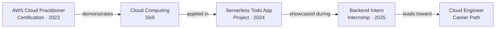
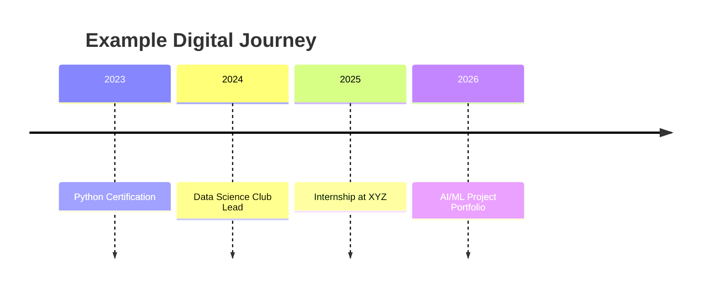
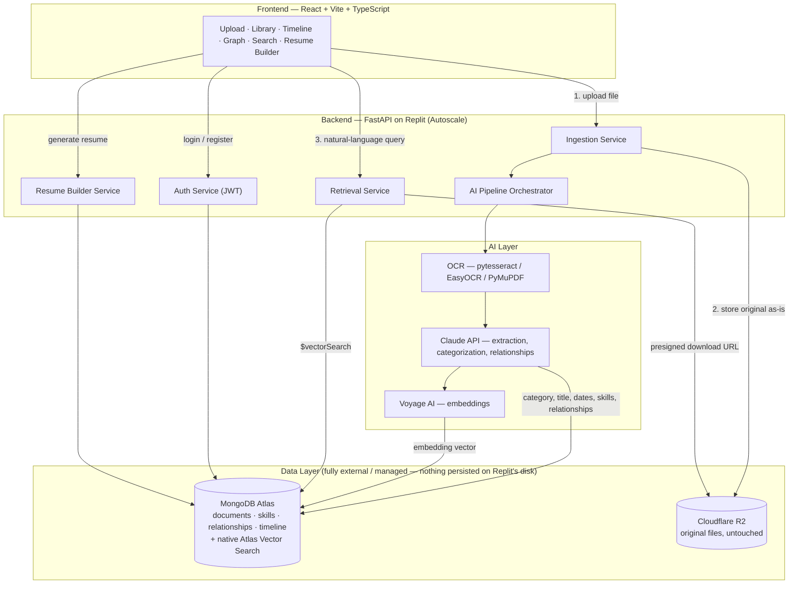
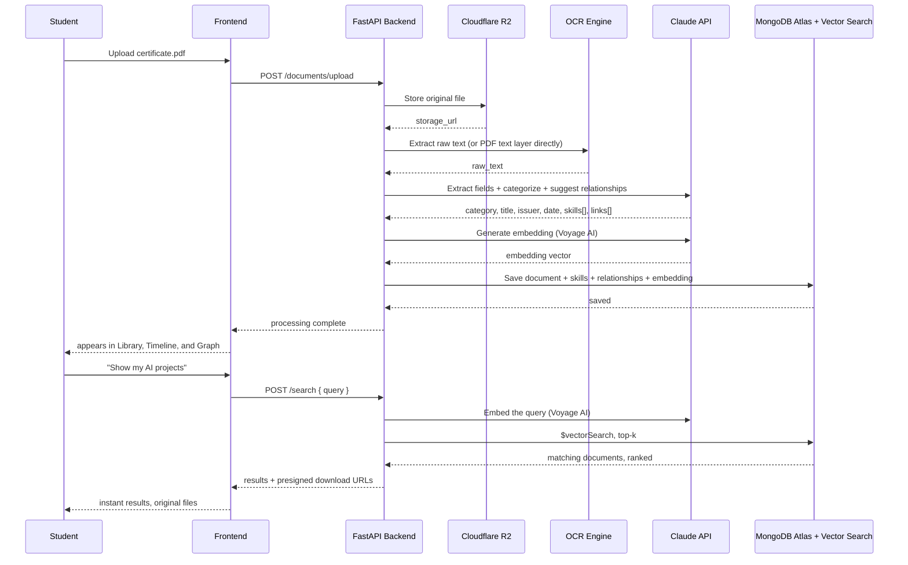

# KizunaX
### AI-Powered Digital Identity System for Students

> **Naming note:** *KizunaX* is the working title carried over from our last planning session. It's a placeholder — find-and-replace it in this file and in `KizunaX_Replit_Agent_Prompt.md` if you've settled on a different name.

> **What changed since the last version of this doc:** everything below still uses the FastAPI + MongoDB stack we already agreed on, but I've dropped **ChromaDB as a separate vector database**. MongoDB Atlas now does vector search natively, even on the free tier — so the same database that stores your documents also handles semantic search. One less service to run, one less thing that breaks, and it removes the Reserved-VM-vs-Autoscale persistence problem entirely, since nothing needs to live on Replit's local disk anymore. Section 15 explains this in full.

---

## 1. Tagline

**"Every certificate, project, and internship — understood, connected, and instantly findable. You never have to search a folder again."**

## 2. Vision

Students accumulate proof of their growth — a certificate here, a hackathon repo there, an internship letter buried in an email thread — but that proof stays scattered and mute. KizunaX exists to turn that scattered archive into a living record: a system that reads what a student uploads, understands what it means, and quietly stitches it into a single, explorable story of who they're becoming.

## 3. Mission

- Remove manual filing entirely — categorization happens the moment a file lands.
- Make every skill, project, certificate, and internship aware of the others it's connected to.
- Turn a folder of PDFs into a timeline a recruiter — or the student themselves — can actually read.
- Never trap the original file. Every document stays downloadable in its original format, forever.
- Ship something an evaluator can test live in under two minutes: upload a certificate, watch it categorize itself, ask for it back in plain English.

## 4. Problem Statement

A student's academic and professional life produces a constant stream of documents — certificates, resumes, project reports, internship letters, portfolio links — and almost none of it lives anywhere coherent. It's spread across downloads folders, email attachments, and cloud drives, disconnected from each other even when one directly caused the next (a certification that led to a skill, a skill that got used in a project, a project that led to an internship).

Cloud storage solves *retrieval by memory* — you can find a file if you remember where you put it. It does nothing for *retrieval by meaning* — "show me proof I know Python" — and nothing at all for showing how the pieces connect over time.

KizunaX is not another drive. It's a system that reads a document once, understands what it is and what it proves, and files it, links it, and time-stamps it automatically — so the student's entire journey becomes a single searchable, connected identity instead of a pile of unrelated files.

## 5. Key Questions This Product Answers

| Question | How KizunaX answers it |
|---|---|
| **Intelligent Organization** — can uploads be organized without manual sorting? | Every upload runs through OCR → LLM extraction → categorization the moment it's received. No folders to pick, no tags to type. |
| **Knowledge Connections** — can the system connect skills, projects, certifications, internships, and achievements? | The Relationship Engine (Module 3) compares each new document against the student's existing corpus and creates typed edges — Certification → Skill → Project → Internship → Career Path. |
| **Instant Retrieval** — can users get any document back without digging through folders? | The Smart Retrieval System (Module 5) answers natural-language queries ("show my AI projects") with a vector search over everything the student has uploaded, and always hands back the original file. |

## 6. Core Modules

### Module 1 — AI Data Ingestion
Accepts certificates, resumes, project reports, internship letters, portfolio links, and general academic/professional documents via drag-and-drop or link paste. Every file is preserved byte-for-byte in object storage before anything else happens to it.

### Module 2 — Intelligent Categorization
Classifies each upload into **Projects, Skills, Certifications, Internships, Achievements,** or **Academics** without the student choosing a category. Classification is a byproduct of the same LLM call that extracts the document's fields, not a separate manual step.

### Module 3 — Relationship Engine
Builds typed edges across the student's corpus: `Certification → Skill`, `Skill → Project`, `Project → Internship`, `Internship → Career Path`. Example of what this looks like once populated:



### Module 4 — Digital Journey Timeline
Every extracted date becomes a point on a chronological timeline of the student's growth:



### Module 5 — Smart Retrieval System
Natural-language queries — *"show all my certificates," "show my AI projects," "show my latest resume"* — return matching documents in their original format via a semantic (vector) search, not a filename or folder lookup.

### Module 6 — Resume & Portfolio Auto-Builder *(extension beyond the base brief)*
This is the piece you specifically asked to prioritize: once documents are categorized, KizunaX can assemble a resume or portfolio draft directly from the structured data already extracted — no re-typing achievements by hand. Covered in Phase 5 of the build.

---

## 7. System Architecture



**Why nothing lives on Replit's own disk:** both stateful pieces — MongoDB Atlas and Cloudflare R2 — are external managed services reached over the network. The FastAPI app itself holds no data between requests, which means it can run on Replit's cheapest, scale-to-zero deployment type without any risk of losing data when instances spin down. More on this in Section 15.

## 8. AI Pipeline Walkthrough



**Step-by-step, in words:**

1. **Upload** — file hits `/documents/upload`, saved to a temp path.
2. **Preserve the original** — pushed to Cloudflare R2 unmodified; this URL is permanent and is what "download original" always points to.
3. **Extract text** — if the PDF has a real text layer, pull it directly (PyMuPDF); if it's a scan or an image (most certificates), run OCR (pytesseract, with EasyOCR as a fallback for messier scans/handwriting).
4. **Structured extraction + categorization** — one Claude API call, given the raw OCR text, returns structured JSON: document type, title, issuing organization, date(s), skills/technologies mentioned, and a first guess at how it relates to the student's existing documents. Combining extraction and categorization into a single call keeps this cheap and fast.
5. **Embed** — the extracted text + metadata is embedded via Voyage AI and stored alongside the document in MongoDB Atlas.
6. **Link** — the Relationship Engine compares the new document's extracted skills/entities against what's already in the student's corpus (via vector similarity + a Claude reasoning pass) and writes new edges: Certification → Skill, Skill → Project, Project → Internship, Internship → Career Path.
7. **Timeline placement** — the extracted date(s) place the document on the Digital Journey Timeline automatically.
8. **Retrieval** — any later natural-language query embeds the query, runs `$vectorSearch` against MongoDB Atlas, and returns ranked original files via presigned R2 URLs.

---

## 9. Tech Stack

### 9.1 Frontend

| Choice | Why |
|---|---|
| **React 18 + Vite + TypeScript** | Fast dev server, strong AI-agent code generation support, type safety catches mistakes before they hit the browser. |
| **Tailwind CSS + shadcn/ui** | Ships a polished UI fast without hand-rolling components — important when most of your time budget should go to the AI pipeline, not buttons. |
| **TanStack Query** | Handles loading/error/caching states for every API call without writing that logic by hand for each screen. |
| **react-dropzone** | Drag-and-drop upload with per-file progress, needed for Module 1. |
| **Recharts / Mermaid-rendered timeline** | Visualizes Module 4's Digital Journey Timeline. |
| **react-force-graph or React Flow** | Renders Module 3's relationship graph as something you can actually click through in a demo. |

### 9.2 Backend

| Choice | Why |
|---|---|
| **Python 3.11 + FastAPI + Uvicorn** | Async by default, auto-generates OpenAPI docs at `/docs` (handy for the demo and for your architecture-diagram deliverable), and every OCR/NLP library you need is Python-native. |
| **Pydantic v2** | Same schema definitions validate incoming requests, outgoing responses, *and* the structured JSON Claude returns — one source of truth. |
| **python-jose + passlib[bcrypt]** | JWT auth and password hashing; matches what's already used in the integration code from our earlier session. |
| **python-multipart** | Required by FastAPI for handling file uploads. |

### 9.3 Database & Vector Search

| Choice | Why |
|---|---|
| **MongoDB Atlas (M0 free tier) + Beanie ODM** | Document-oriented storage fits naturally — a certificate, a resume, and a project report all have different shapes, and Mongo doesn't force them into the same rigid columns a SQL table would. Beanie is async and Pydantic-native, so your API schema and your DB schema are the same class. |
| **Atlas Vector Search (native, same cluster)** | This replaces a standalone ChromaDB. Atlas now runs vector search directly on the free M0 tier — embeddings live as a field on the same document they describe, queried with a `$vectorSearch` aggregation stage. You get semantic search for Module 5 without running, hosting, or worrying about persisting a second database. |

### 9.4 Object Storage

| Choice | Why |
|---|---|
| **Cloudflare R2** | S3-compatible (works with `boto3`/`aioboto3` unchanged), no egress fees — meaningful if your demo involves downloading original files repeatedly during judging. Files are stored exactly as uploaded and served back via presigned URLs. |

### 9.5 AI / NLP Layer

| Choice | Why |
|---|---|
| **pytesseract + pdf2image / PyMuPDF** | Baseline OCR and native PDF text extraction — free, local, no API cost per page. |
| **EasyOCR** | Fallback for handwritten notes or low-quality scans where Tesseract struggles. |
| **Claude API (`claude-sonnet-5`)** | Does the actual understanding: turns messy OCR text into structured fields, assigns a category, and reasons about how a new document relates to everything the student has already uploaded. This is a job for an LLM, not a hand-tuned NER model — OCR output is noisy, and a classifier trained on clean text won't generalize to a scanned, slightly crooked certificate photo. |
| **`claude-haiku-4-5-20251001`** *(optional cost optimization)* | If you're processing a large batch of uploads at once (a student dumping years of files in one go is a very likely demo moment), route simple/high-confidence categorization calls to Haiku and reserve Sonnet for extraction and relationship reasoning. The [Message Batches API](https://docs.claude.com/en/api/overview) is also worth using here — it runs large volumes of calls asynchronously at roughly half the per-call cost, which fits a "bulk-upload the whole archive" demo well. |
| **Voyage AI (`voyage-3.5`)** | Anthropic doesn't run its own embedding model and officially points developers to Voyage AI as its embeddings partner — this is the accurate, current pairing rather than assuming Claude does embeddings itself. If you want a fully free/offline fallback with no second API key, `sentence-transformers` (e.g. `all-MiniLM-L6-v2`) runs locally at the cost of somewhat lower retrieval quality. |

### 9.6 Auth & Security

| Choice | Why |
|---|---|
| **JWT access tokens (python-jose)** | Stateless auth that doesn't need a session store. |
| **bcrypt via passlib** | Standard password hashing, never store plaintext. |
| **Fernet encryption (`cryptography` package)** | For OAuth tokens at rest if you build the Google Drive / Notion integrations in Phase 5 — reused from the integration code already written for this project. |

### 9.7 DevOps / Deployment

| Choice | Why |
|---|---|
| **Replit** | Build environment and host in one place; Agent scaffolds the initial structure from the prompts in the companion file. |
| **Replit Autoscale deployment** | Recommended default (see Section 15) — scales to zero when idle, billed per request, and safe to use precisely *because* nothing stateful lives on the Repl's own disk anymore. |
| **Replit Secrets** | Stores every API key and connection string. Note: secrets set in the workspace do **not** automatically carry over to a deployment — they need to be added again under the Deployments pane's own Secrets section, which is the single most common cause of a Replit app that "works in the editor but breaks once published." |
| **GitHub-connected Repl** | Satisfies the "GitHub repository with README" deliverable directly — connect the Repl to a GitHub repo from the start rather than exporting at the end. |

### 9.8 Supporting Tools

| Choice | Why |
|---|---|
| **FastAPI's built-in Swagger UI (`/docs`)** | Lets you test every endpoint without Postman, and doubles as a live artifact for your "thought process sheet" deliverable. |
| **Loguru** | Structured logs make debugging the AI pipeline (which step failed: OCR, extraction, or embedding) much faster than print statements. |
| **Pytest** | Optional, but a couple of tests around the extraction pipeline catch regressions if you keep tuning your Claude prompts. |

---

## 10. Data Models

```python
# User
{
  "id": ObjectId,
  "name": str,
  "email": str,
  "password_hash": str,
  "university": str | None,
  "graduation_year": int | None,
  "created_at": datetime,
}

# Document — the core ingested item (certificate, resume, report, letter...)
{
  "id": ObjectId,
  "user_id": ObjectId,
  "original_filename": str,
  "file_type": "pdf" | "image" | "docx",
  "storage_url": str,              # Cloudflare R2 path
  "category": "Certification" | "Project" | "Internship" | "Achievement" | "Academic" | "Resume" | "Other",
  "title": str,                    # AI-generated or extracted
  "issuer": str | None,
  "issue_date": date | None,
  "raw_text": str,                 # OCR / extracted text
  "extracted_fields": dict,        # structured JSON from Claude
  "embedding": list[float],        # Voyage AI vector, indexed for $vectorSearch
  "tags": list[str],
  "external_links": dict | None,   # e.g. synced Google Drive / Notion refs
  "created_at": datetime,
  "updated_at": datetime,
}

# Skill
{
  "id": ObjectId,
  "user_id": ObjectId,
  "name": str,
  "category": "technical" | "soft" | "tool" | "language",
  "source_document_ids": list[ObjectId],
  "first_seen_date": date,
}

# Relationship — an edge in the knowledge graph
{
  "id": ObjectId,
  "user_id": ObjectId,
  "source_type": "Document" | "Skill",
  "source_id": ObjectId,
  "target_type": "Document" | "Skill",
  "target_id": ObjectId,
  "relationship_type": "demonstrates" | "applied_in" | "showcased_during" | "leads_toward",
  "confidence_score": float,
  "created_by": "ai" | "manual",
}

# TimelineEvent
{
  "id": ObjectId,
  "user_id": ObjectId,
  "date": date,
  "title": str,
  "description": str,
  "related_document_ids": list[ObjectId],
  "event_type": "certification" | "internship" | "achievement" | "project" | "academic",
}

# Integration (Phase 5, optional)
{
  "id": ObjectId,
  "user_id": ObjectId,
  "provider": "google_drive" | "notion",
  "encrypted_access_token": str,
  "encrypted_refresh_token": str,
  "connected_at": datetime,
  "external_ref_id": str,          # folder ID or database ID
}
```

## 11. API Surface

| Method | Endpoint | Purpose |
|---|---|---|
| `POST` | `/auth/register` | Create account |
| `POST` | `/auth/login` | Get JWT |
| `GET` | `/auth/me` | Current user profile |
| `POST` | `/documents/upload` | Upload a file, kicks off the AI pipeline (Module 1) |
| `GET` | `/documents` | List documents; filter by category, date range, tag |
| `GET` | `/documents/{id}` | Single document, with extracted fields |
| `GET` | `/documents/{id}/download` | Presigned URL to the original file |
| `DELETE` | `/documents/{id}` | Remove a document |
| `POST` | `/search` | Natural-language query → `$vectorSearch` → ranked documents (Module 5) |
| `GET` | `/timeline` | Chronological event list (Module 4) |
| `GET` | `/skills` | All skills, with source documents |
| `GET` | `/relationships/graph` | Graph data for the relationship visualization (Module 3) |
| `POST` | `/resume/generate` | Assemble a resume draft from categorized data (Module 6) |
| `GET` | `/integrations` | List connected providers |
| `POST` | `/integrations/{provider}/connect` | Start OAuth flow |
| `GET` | `/integrations/{provider}/callback` | OAuth callback |
| `DELETE` | `/integrations/{provider}/disconnect` | Revoke access |

## 12. Frontend Pages

- **Login / Register**
- **Dashboard** — quick stats (X certificates, Y projects, Z skills), recent activity
- **Upload** — drag-and-drop, live per-file status: *Uploading → Reading text → Extracting → Categorizing → Done*
- **Library** — grid/list of all documents, filterable by category, searchable
- **Document Detail** — extracted fields, original file preview + download, related items
- **Timeline** — the visual Digital Journey (Module 4)
- **Relationship Graph** — interactive skill/project/certification graph (Module 3)
- **Resume Builder** — pick categorized data, generate a draft (Module 6)
- **Settings** — profile, connected integrations

## 13. Repository Structure

```
kizunax/
├── backend/
│   ├── app/
│   │   ├── api/                  # route handlers
│   │   ├── core/                 # config, security, crypto.py
│   │   ├── models/db/            # Beanie models
│   │   ├── integrations/         # google_drive_client.py, notion_client.py
│   │   ├── pipeline/             # ocr.py, extract.py, embed.py, relate.py
│   │   └── main.py
│   ├── requirements.txt
│   └── .env.example
├── frontend/
│   ├── src/
│   │   ├── components/
│   │   ├── pages/
│   │   ├── hooks/
│   │   └── api/                  # typed API client
│   ├── package.json
│   └── vite.config.ts
├── docs/
│   ├── KizunaX_Project_Documentation.md   # this file
│   └── architecture-diagram.png           # exported from the Mermaid diagrams above
└── README.md
```

## 14. Environment Variables

```dotenv
# Database (also powers vector search — no separate vector DB needed)
MONGODB_URI=

# Object Storage (Cloudflare R2)
R2_ACCOUNT_ID=
R2_ACCESS_KEY_ID=
R2_SECRET_ACCESS_KEY=
R2_BUCKET_NAME=
R2_PUBLIC_URL=

# AI / LLM
ANTHROPIC_API_KEY=

# Embeddings
VOYAGE_API_KEY=

# Auth
JWT_SECRET_KEY=
JWT_ALGORITHM=HS256
ACCESS_TOKEN_EXPIRE_MINUTES=60

# OAuth token encryption (Phase 5)
INTEGRATION_ENCRYPTION_KEY=

# OAuth — Google Drive (Phase 5)
GOOGLE_CLIENT_ID=
GOOGLE_CLIENT_SECRET=
GOOGLE_REDIRECT_URI=

# OAuth — Notion (Phase 5)
NOTION_CLIENT_ID=
NOTION_CLIENT_SECRET=
NOTION_REDIRECT_URI=

# App
FRONTEND_URL=
BACKEND_URL=
```

Set every one of these in Replit's **Secrets** tool — never in a committed `.env` file. Remember to add them a second time under the **Deployments** pane once you publish; workspace secrets and deployment secrets are separate stores.

## 15. Deploying on Replit

This is the part that changed from our earlier plan, so here's the full reasoning:

**The original plan** kept ChromaDB as a standalone vector database. Chroma's simplest mode writes its index to a local folder — fine on your laptop, but a problem on Replit's **Autoscale** deployments, which scale servers up and down (down to zero when idle) rather than keeping one fixed machine running. Anything written to local disk on one instance isn't guaranteed to be there when the next request lands on a different instance. The fix would have been a **Reserved VM** (one dedicated machine that never sleeps, so local files persist) — but that's a fixed $20+/month cost, and it exists only to solve a problem this project doesn't need to have.

**The current plan** drops Chroma. MongoDB Atlas runs vector search natively — including on the free M0 tier — so embeddings are stored as a field on the same document they describe, in the same database you're already using. Nothing related to search or storage lives on Replit's disk at all. That means:

- **Deployment type: Autoscale.** It's the default Replit suggests, it's the cheapest option (starts around $1/month plus usage for light traffic — a realistic fit for a hackathon demo), and it's now fully safe because the app holds no state between requests.
- **Reserved VM is no longer required.** Keep it in your back pocket only if you later add something that genuinely needs to stay running continuously, like a background worker reprocessing a huge backlog of documents.
- **Static deployment doesn't apply here** — it can't run the FastAPI backend Agent will build, only pre-built HTML/CSS/JS.

**Before you deploy:**
1. Push every variable from Section 14 into Replit's Secrets tool.
2. Connect the Repl to a GitHub repository (Replit has a one-click "Connect to GitHub" option) — this covers your README deliverable without extra work later.
3. Click **Publish**, choose **Autoscale**, and re-enter your secrets in the Deployments pane's Secrets section — this step is easy to miss and is the most common reason a Replit app works in the editor but 500s once published.

## 16. Build Roadmap

| Phase | Focus | Detail |
|---|---|---|
| **1** | Foundation | Auth, file upload → R2, MongoDB connection, basic CRUD, project scaffolding |
| **2** | AI Extraction | OCR pipeline + Claude-based structured extraction |
| **3** | Understanding | Categorization, Relationship Engine, Atlas Vector Search embeddings |
| **4** | Experience | Timeline, Smart Retrieval (semantic search), core frontend screens |
| **5** | Polish | Resume Builder, optional Google Drive / Notion sync, deployment |

Matching, copy-pasteable prompts for each phase are in `KizunaX_Replit_Agent_Prompt.md`.

## 17. Success Metric

The demo succeeds the moment a reviewer uploads a certificate, watches it categorize and link itself with no manual input, then types *"show me my certificates"* and gets the original file back instantly. That single loop — upload → understand → retrieve — is the whole pitch.

## 18. Hackathon Deliverables Checklist

- [ ] Working prototype or demo video
- [ ] GitHub repository with README (covered by Section 13 + connecting the Repl to GitHub early)
- [ ] AI workflow / architecture diagram (Sections 7–8 — export the Mermaid diagrams as images if a static file is required)
- [ ] Thought process sheet (this document doubles as a strong first draft)
- [ ] Submitted to Wooble portfolio

## 19. Future Enhancements

- Confidence scores surfaced in the UI so students can correct a wrong category/relationship (and that correction becomes training signal)
- Portfolio export as a public shareable link, not just a downloadable resume
- Multi-language OCR/extraction for certificates issued in languages other than English
- A "career path suggestion" pass that reasons across the whole graph, not just document-to-document
